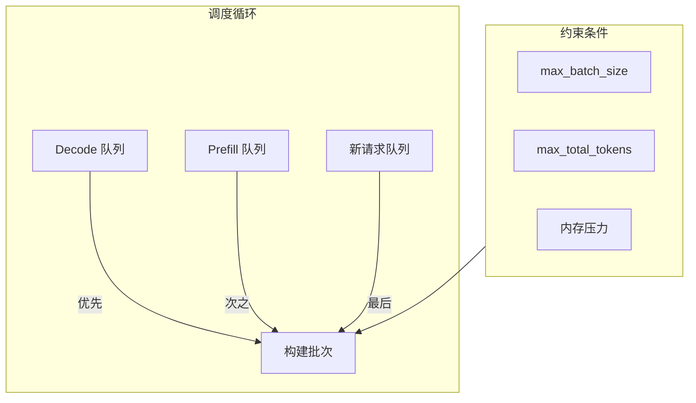
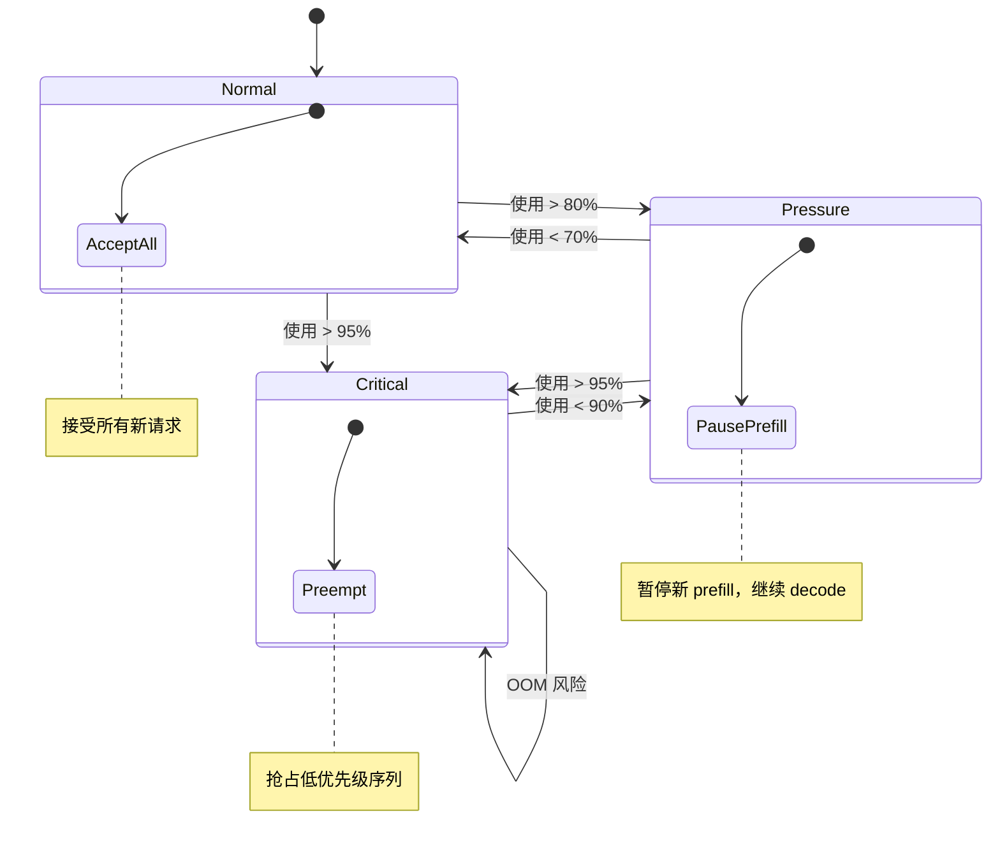

# Continuous Batching

Continuous Batching（连续批处理）是一种动态调度技术，可在推理迭代之间添加/移除序列，显著提升 GPU 利用率和吞吐量。

## 问题：静态批处理

传统静态批处理需要等待所有序列完成才能开始新批次：

```mermaid
gantt
    title 静态批处理时间线
    dateFormat X
    section Batch 1
    Seq 1 Prefill   :0, 2
    Seq 1 Decode    :2, 8
    Seq 2 Prefill   :0, 2
    Seq 2 Decode    :2, 6
    section 空闲
    GPU 空闲等待    :crit, 6, 8
    section Batch 2
    Seq 3 Prefill   :8, 10
    Seq 3 Decode    :10, 15
```



**问题**：
- GPU 空闲等待最短序列完成
- 新请求必须等待整个批次完成
- 吞吐量受限

## 解决方案：连续批处理

Continuous Batching 在每个迭代后动态调整批次：

```mermaid
gantt
    title 连续批处理时间线
    dateFormat X
    section Iteration 1-2
    Seq 1 Prefill   :0, 2
    Seq 2 Prefill   :0, 2
    section Iteration 3-8
    Seq 1 Decode    :2, 8
    Seq 2 Decode    :2, 6
    Seq 3 Prefill   :6, 8
    section Iteration 9-15
    Seq 1 Decode    :8, 15
    Seq 3 Decode    :8, 13
    Seq 4 Prefill   :13, 15
```



**优势**：
- 新请求立即加入批次
- 完成的序列立即释放资源
- GPU 利用率最大化

## 调度策略

### 优先级顺序

1. **Decode 优先**：优先调度 decode 序列，保持低延迟
2. **Prefill 次之**：填充剩余批次槽位
3. **新请求**：在内存允许时开始新的 prefill



### 调度器实现

```rust
impl Scheduler {
    pub fn schedule(&mut self) -> SchedulerOutput {
        let mut output = SchedulerOutput::new();
        let mut num_sequences = 0;
        let mut total_tokens = 0;
        
        // 优先级 1: Decode 序列 (保持低延迟)
        for seq_id in self.decode_queue.iter() {
            if num_sequences >= self.config.max_batch_size {
                break;
            }
            
            // Decode 只需要 1 个 token
            if total_tokens + 1 <= self.config.max_total_tokens {
                output.add_decode(*seq_id);
                num_sequences += 1;
                total_tokens += 1;
            }
        }
        
        // 优先级 2: 等待中的 prefill 序列
        for seq_id in self.prefill_queue.iter() {
            if num_sequences >= self.config.max_batch_size {
                break;
            }
            
            let seq = self.sequences.get(seq_id).unwrap();
            if total_tokens + seq.num_tokens <= self.config.max_total_tokens {
                output.add_prefill(*seq_id, seq.num_tokens);
                num_sequences += 1;
                total_tokens += seq.num_tokens;
            }
        }
        
        // 优先级 3: 新请求 (如果内存充足)
        if !self.under_memory_pressure() {
            while let Some(request) = self.pending_requests.pop_front() {
                if self.can_allocate(&request) {
                    let seq_id = self.add_request(request);
                    output.add_new_prefill(seq_id);
                } else {
                    break;
                }
            }
        }
        
        output
    }
}
```

## 内存压力感知

当内存接近耗尽时，调度器采取防御措施：



### 内存压力检测

```rust
impl Scheduler {
    fn update_memory_state(&mut self, stats: &MemoryStats) {
        let utilization = stats.used_blocks as f32 / stats.total_blocks as f32;
        
        self.memory_state = match utilization {
            u if u > 0.95 => MemoryState::Critical,
            u if u > 0.80 => MemoryState::Pressure,
            _ => MemoryState::Normal,
        };
    }
    
    fn under_memory_pressure(&self) -> bool {
        matches!(self.memory_state, MemoryState::Pressure | MemoryState::Critical)
    }
}
```

## 性能影响

| 指标 | 静态批处理 | 连续批处理 | 提升 |
|------|:----------:|:----------:|:----:|
| GPU 利用率 | ~60% | ~90% | +50% |
| 吞吐量 | 1000 tok/s | 1500 tok/s | +50% |
| 平均延迟 | 200ms | 170ms | -15% |

## 相关

- [PagedAttention](/en/architecture/paged-attention)
- [Memory Management](/en/architecture/memory-management)
- [Throughput Benchmarks](/en/benchmarks/throughput)
