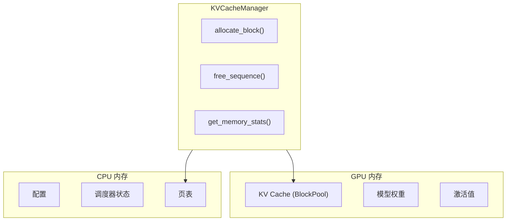
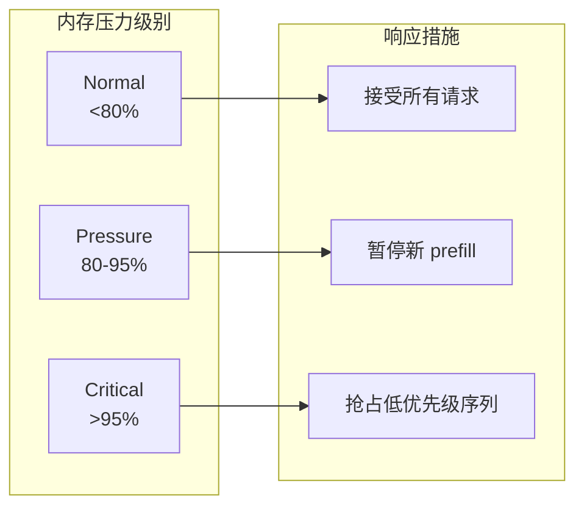

# Memory Management

Hetero-Paged-Infer 的内存管理策略结合了 PagedAttention 和内存压力感知，确保高效且安全的内存使用。

## 内存架构



## 内存配置

```rust
pub struct KVCacheConfig {
    /// 每个块的 token 数量
    pub block_size: u32,           // 默认: 16
    
    /// 物理块总数
    pub num_blocks: u32,           // 根据 GPU 内存计算
    
    /// 内存压力阈值 (0.0 - 1.0)
    pub memory_threshold: f32,     // 默认: 0.85
    
    /// 是否启用抢占
    pub enable_preemption: bool,   // 默认: true
}
```

### 块大小选择

| 块大小 | 优点 | 缺点 |
|--------|------|------|
| 小 (8) | 更细粒度分配 | 更多页表开销 |
| 中 (16) | 平衡 | 平衡 |
| 大 (32) | 更少页表开销 | 更多内部碎片 |

**推荐**: 16 tokens/块，与 vLLM 一致。

### 块数量计算

```rust
fn calculate_num_blocks(
    gpu_memory: u64,
    model_size: u64,
    block_size: u32,
    hidden_dim: u32,
    num_layers: u32,
) -> u32 {
    // 每个 token 的 KV Cache 大小
    let kv_cache_per_token = hidden_dim * num_layers * 2 * 4; // f32 = 4 bytes
    
    // 每个块的大小
    let block_memory = block_size as u64 * kv_cache_per_token as u64;
    
    // 可用于 KV Cache 的内存
    let available_memory = gpu_memory - model_size - ACTIVATION_RESERVE;
    
    (available_memory / block_memory) as u32
}
```

## 内存统计

```rust
pub struct MemoryStats {
    /// 总块数
    pub total_blocks: u32,
    /// 已使用块数
    pub used_blocks: u32,
    /// 空闲块数
    pub free_blocks: u32,
    /// 内存利用率
    pub utilization: f32,
    /// 活跃序列数
    pub active_sequences: usize,
}

impl KVCacheManager {
    pub fn get_memory_stats(&self) -> MemoryStats {
        MemoryStats {
            total_blocks: self.block_pool.blocks.len() as u32,
            used_blocks: self.block_pool.blocks.len() as u32 
                - self.block_pool.free_list.len() as u32,
            free_blocks: self.block_pool.free_list.len() as u32,
            utilization: self.calculate_utilization(),
            active_sequences: self.page_tables.len(),
        }
    }
}
```

## 内存压力处理

### 分级响应



### 抢占策略

当内存不足时，系统可以抢占低优先级序列：

```rust
pub enum PreemptionPolicy {
    /// 抢占最晚到达的序列 (默认)
    FIFO,
    /// 抢占剩余 token 最多的序列
    LongestRemaining,
    /// 抢占优先级最低的序列
    LowestPriority,
}

impl Scheduler {
    fn preempt_sequence(&mut self) -> Option<SeqId> {
        match self.preemption_policy {
            PreemptionPolicy::FIFO => {
                // 找到最晚的 prefill 序列
                self.prefill_queue.pop_back()
            }
            PreemptionPolicy::LongestRemaining => {
                // 找到剩余 token 最多的序列
                self.find_longest_remaining()
            }
            PreemptionPolicy::LowestPriority => {
                // 找到优先级最低的序列
                self.find_lowest_priority()
            }
        }
    }
}
```

### 抢占与恢复

被抢占的序列可以保存状态并稍后恢复：

```rust
pub struct PreemptedSequence {
    seq_id: SeqId,
    /// 已生成的 token
    generated_tokens: Vec<TokenId>,
    /// 原始请求
    request: Request,
    /// 抢占时间
    preempted_at: Instant,
}

impl InferenceEngine {
    pub fn preempt(&mut self, seq_id: SeqId) -> PreemptedSequence {
        let seq = self.scheduler.get_sequence(seq_id);
        
        // 保存状态
        let preempted = PreemptedSequence {
            seq_id,
            generated_tokens: seq.generated_tokens.clone(),
            request: seq.request.clone(),
            preempted_at: Instant::now(),
        };
        
        // 释放内存
        self.scheduler.remove_sequence(seq_id);
        self.kv_manager.free_sequence(seq_id);
        
        preempted
    }
    
    pub fn restore(&mut self, preempted: PreemptedSequence) -> SeqId {
        // 重新提交请求
        self.submit_request(preempted.request)
    }
}
```

## 内存效率验证

通过属性测试验证内存不变量：

```rust
proptest! {
    /// 验证：used + free == total
    #[test]
    fn prop_block_count_invariant(
        ops: Vec<KVOperation>,
        num_blocks: u32,
        block_size: u32
    ) {
        let mut manager = KVCacheManager::new(num_blocks, block_size);
        
        for op in ops {
            execute_operation(&mut manager, op);
            
            let stats = manager.get_memory_stats();
            prop_assert_eq!(
                stats.used_blocks + stats.free_blocks,
                stats.total_blocks
            );
        }
    }
    
    /// 验证：引用计数一致
    #[test]
    fn prop_refcount_consistency(ops: Vec<KVOperation>) {
        let mut manager = KVCacheManager::new(100, 16);
        
        for op in ops {
            execute_operation(&mut manager, op);
        }
        
        // 所有活跃序列的引用总数应该等于所有非空闲块的引用计数之和
        let active_refs: u32 = manager.page_tables.values()
            .map(|pt| pt.len() as u32)
            .sum();
        
        let block_refs: u32 = manager.block_pool.blocks.iter()
            .map(|b| b.ref_count)
            .sum();
        
        prop_assert_eq!(active_refs, block_refs);
    }
}
```

## 相关

- [PagedAttention](/en/architecture/paged-attention)
- [Continuous Batching](/en/architecture/continuous-batching)
