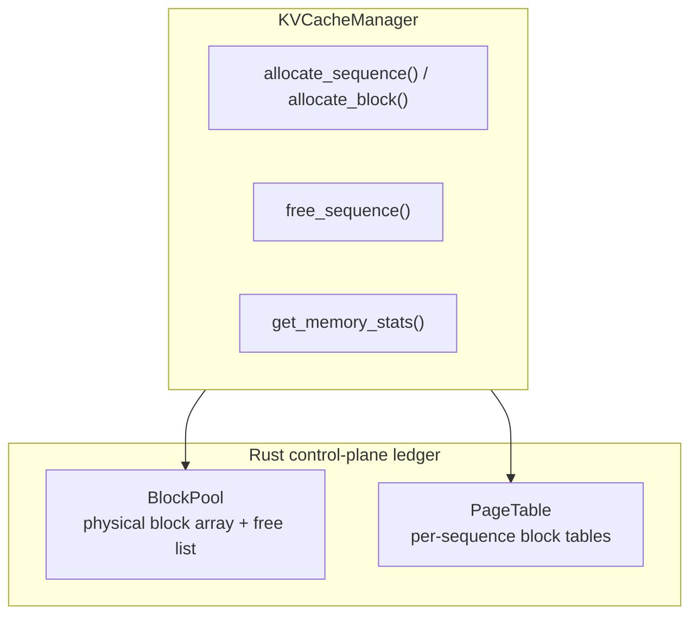

# Memory Management

Memory management in Hetero-Paged-Infer consists of a fixed-size block pool, per-sequence page tables, and a single-threshold admission policy. Block allocation and reclamation are pure Rust-side bookkeeping; they are not yet backed by real GPU memory — but this ledger gives the scheduler a real, queryable basis for resource decisions.

## Memory Architecture



A physical block (`PhysicalBlock`) carries only `block_idx` and `ref_count`; it holds no KV tensors or GPU pointers. The project loads no model weights, so there is no weights / activations memory region either.

## Memory Configuration

Memory-related parameters live on `EngineConfig` (there is no separate KV cache config struct):

```rust
pub struct EngineConfig {
    /// Tokens per physical block (default: 16)
    pub block_size: u32,

    /// Maximum number of physical blocks; total capacity = max_num_blocks * block_size tokens (default: 1024)
    pub max_num_blocks: u32,

    /// Memory pressure threshold, valid range (0.0, 1.0] (default: 0.9)
    pub memory_threshold: f32,
    // ... remaining fields are not directly related to memory management
}
```

### Block Size Selection

| Block Size | Pros | Cons |
|------------|------|------|
| Small (8) | Finer-grained allocation | More page table overhead |
| Medium (16) | Balanced | Balanced |
| Large (32) | Less page table overhead | More tail waste in the last block |

The default is 16 tokens/block, also a common value in vLLM.

## Memory Pressure Handling

The system has a single threshold — **no pressure tiers, no preemption, no swap, no eviction**:

- On admission and scheduling, the scheduler computes `utilization = used_blocks / total_blocks`
- When `utilization >= memory_threshold`, `Scheduler::add_request` returns `SchedulerError::MemoryPressure`, rejecting new requests
- The HTTP layer maps this error to **429 Too Many Requests** with a `Retry-After` header
- In-flight decode sequences are unaffected; when they complete or fail, their blocks are reclaimed, utilization drops, and admission recovers automatically

```rust
pub fn add_request(&mut self, request: Request) -> Result<SeqId, SchedulerError> {
    self.update_memory_pressure();

    if self.under_memory_pressure {
        return Err(SchedulerError::MemoryPressure);
    }
    // ... concurrency cap check, then enqueue
}
```

Reference counting is used only for block allocation and reclamation: allocation sets `ref_count` to 1, and `free_sequence` brings it back to 0, returning the block to the free list. There is currently no block sharing between sequences; copy-on-write is a future direction, and the reference count is its scaffolding (see also "Current implementation status" in [PagedAttention](/en/architecture/paged-attention)).

## Memory Statistics

```rust
pub struct MemoryStats {
    /// Total number of physical blocks
    pub total_blocks: u32,
    /// Number of used physical blocks
    pub used_blocks: u32,
    /// Number of free physical blocks
    pub free_blocks: u32,
    /// Number of active sequences
    pub num_sequences: u32,
}

impl MemoryStats {
    /// Memory utilization = used_blocks / total_blocks
    pub fn utilization(&self) -> f32;
}
```

`KVCacheManager::get_memory_stats()` returns this struct; the scheduler's admission decision and the memory metrics exposed by the serving layer's `/metrics` are both built on it.

## Memory Efficiency Verification

Memory invariants are verified with property tests (proptest, in `src/kv_cache.rs`):

```rust
proptest! {
    /// Verifies: used + free == total
    #[test]
    fn prop_block_count_invariant(
        ops in prop::collection::vec(arb_cache_op(), 0..50),
        num_blocks in 10u32..200,
        block_size in 1u32..32,
    ) {
        let mut manager = KVCacheManager::new(num_blocks, block_size);

        for op in ops {
            apply_operation(&mut manager, op);  // allocate / free / grow

            let stats = manager.get_memory_stats();
            prop_assert_eq!(
                stats.used_blocks + stats.free_blocks,
                stats.total_blocks
            );
        }
    }
}
```

The same file also covers initial allocation, growth allocation, and statistics consistency properties (`prop_block_allocation_on_sequence_start`, `prop_block_allocation_on_growth`, `prop_memory_statistics_invariant`).

## Related

- [PagedAttention](/en/architecture/paged-attention)
- [Continuous Batching](/en/architecture/continuous-batching)
