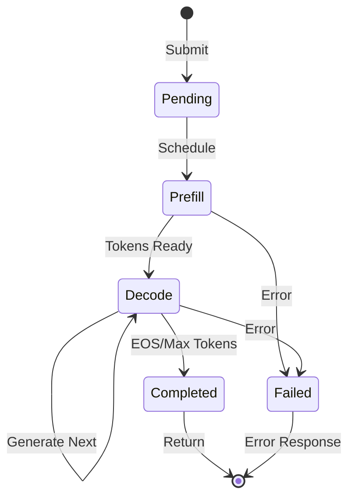
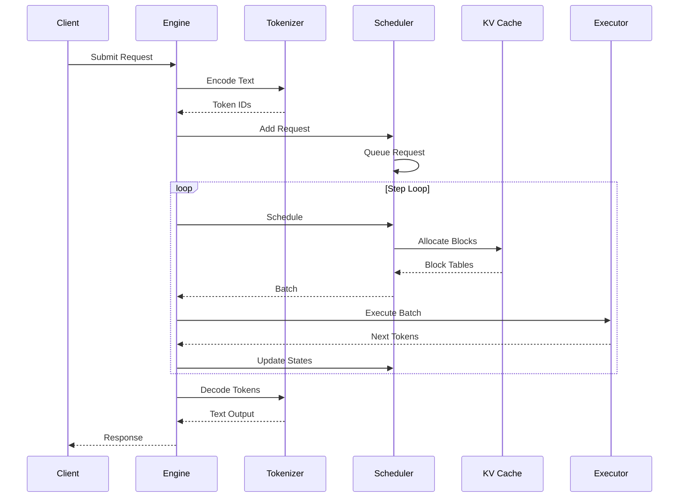

# Architecture Overview

## Design Philosophy

Hetero-Paged-Infer is an LLM inference engine scaffold: it implements PagedAttention-style paged memory, a continuous batching scheduler, and an OpenAI-compatible HTTP serving layer. The compute backend is currently a mock / placeholder implementation — scheduling, memory accounting, and the serving path are real, runnable, tested code; real model computation (weight loading, attention kernels) is future work. See the "Current boundaries" section on the landing page.

### Core Principles

1. **Rust Control Plane** - Scheduling, block accounting, page tables, and batch construction all live in Rust, where they can be reasoned about and tested
2. **Pluggable Compute Backend** - `GPUExecutorTrait` abstracts batch execution; the default mock executor generates deterministic placeholder tokens
3. **Memory Efficiency** - Block pool + page table paged allocation avoids the waste of reserving contiguous memory per request
4. **Continuous Batching** - Decode-priority batch construction prioritizes in-flight requests

## High-Level Architecture

<ThemeAwareFigure
  light="/images/figures/architecture-light.svg"
  dark="/images/figures/architecture-dark.svg"
  alt="Hetero-Paged-Infer control plane and compute plane architecture"
  caption="The architecture is presented as a control-plane / compute-plane split, not a flat feature list."
/>

## Component Breakdown

### 1. Inference Engine

The main orchestrator that coordinates all components:

```rust
pub struct InferenceEngine {
    config: EngineConfig,
    tokenizer: Box<dyn TokenizerTrait>,
    scheduler: Scheduler,
    execution_pipeline: BatchExecutionPipeline,
    eos_token_id: u32,
    // internal counters: total/completed/failed requests, tokens generated, etc.
}
```

**Responsibilities:**
- Request lifecycle management (submit, step, complete/fail)
- Step-wise execution loop (schedule → execute → collect results)
- Execution retry (`max_retry_attempts`, for GpuTimeout)
- Metrics collection (exposed via the serving layer's `/metrics`)

### 2. Scheduler

Implements **Continuous Batching** with decode priority:



**Scheduling Algorithm:**

```
1. Collect decode requests (highest priority, lower latency for in-flight requests)
2. Fill remaining batch slots with prefill requests (in seq_id order, FCFS)
3. Respect batch size, total token, concurrency, and memory constraints
4. Update request states; reject new requests when utilization ≥ memory_threshold
```

### 3. KV Cache Manager

Implements a **PagedAttention**-style paged memory ledger. The block pool is a fixed-size array of physical blocks plus a free list; each sequence maintains a page table:

```
┌─────────────────────────────────────────────────────────────┐
│          KV Cache Block Pool (Rust control-plane ledger)     │
├─────────────────────────────────────────────────────────────┤
│ Block 0 │ Block 1 │ Block 2 │ ... │ Block N                  │
└─────────────────────────────────────────────────────────────┘
      ↑
Page Table Mapping:
  Sequence 0: [Block 3] → [Block 7] → [Block 12]
  Sequence 1: [Block 1] → [Block 5] → [Block 9]
```

Note: physical blocks currently carry only ledger metadata (`block_idx` + `ref_count`); they do not yet hold real KV tensors. A real backend consuming this block-table structure is future work.

### 4. GPU Executor

Abstracts batch execution:

```rust
pub trait GPUExecutorTrait: Send {
    fn execute(&mut self, batch: &ExecutionBatch)
        -> Result<ExecutionOutput, ExecutionError>;
}
```

The default `MockGPUExecutor` generates deterministic placeholder tokens (independent of input content); the minimal kernel path behind the `cuda` feature likewise only performs `(seed + index) % vocab_size` placeholder generation. Neither loads weights, consumes the KV cache, nor computes attention.

## Data Flow

### Request Processing Pipeline



## Memory Model

### Block Structure

```rust
pub struct PhysicalBlock {
    pub block_idx: BlockIdx,  // physical block index
    pub ref_count: u32,       // reference count; free when zero
}

pub struct LogicalBlock {
    pub block_idx: u32,                    // logical block index within the sequence
    pub physical_block: PhysicalBlockRef,  // mapped physical block
}
```

Physical blocks currently hold no GPU memory pointer; `ref_count` is used only for allocation and reclamation. Copy-on-write style block sharing is a future direction — the reference count is the scaffolding for it.

### Memory Layout

With the default `block_size = 16`, a sequence's tokens are organized by block:

```
Token Positions:
┌─────────────────────────────────────────────────────┐
│ Block 0 │ Block 1 │ Block 2 │ Block 3 │ Block 4     │
│ 0-15    │ 16-31   │ 32-47   │ 48-63   │ 64-79       │
└─────────────────────────────────────────────────────┘
```

The last block of a sequence is typically not full — this is the only waste boundary inside the block model.

## Performance Characteristics

### Benchmarks

The current benchmarks (`benches/`, Criterion-based) measure engine-level overhead only: engine creation, request submission, single-step scheduling, and KV cache allocation and growth. They **do not measure token throughput** and produce no tokens/s figures.

### Memory Efficiency (Literature Context)

The figures below are observations from the PagedAttention paper (Kwon et al., 2023) and related prior art, **not measurements of this project**; they serve only to motivate paged allocation:

| Method | Internal Waste | External Frag | Total |
|--------|---------------|---------------|-------|
| Static | ~45% | ~10% | ~55% |
| Dynamic | ~20% | ~8% | ~28% |
| **Paged** | **<5%** | **<2%** | **<7%** |

## Scalability

The engine is currently a single-process implementation: one scheduler, one block pool, one serving instance. Horizontal scaling (multiple instances behind a load balancer) is not a current capability; it is a future direction.

Capacity tuning within a single process is done through `EngineConfig`:

- `max_num_blocks × block_size` determines total KV cache token capacity
- `max_batch_size` / `max_num_seqs` bound per-batch size and concurrent sequences
- `memory_threshold` sets the utilization admission cutoff

## Security Considerations

1. **Admission Control** - New requests are rejected when memory utilization ≥ threshold or the concurrency cap is reached (HTTP 429 + `Retry-After`)
2. **Input Validation** - Token count limits such as `max_model_len`; invalid parameters return 400
3. **Execution Retry** - GpuTimeout is retried up to `max_retry_attempts`, then the batch is failed
4. **Error Isolation** - Failed requests release their blocks without affecting other in-flight sequences

---

Next: [Design Principles](design)
