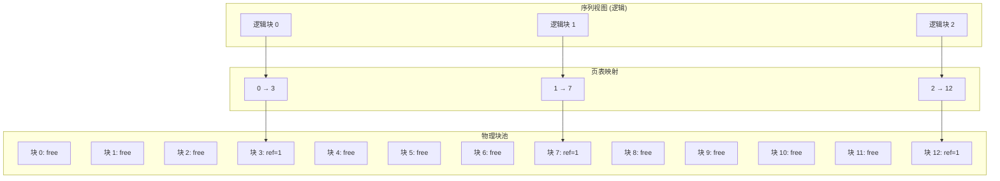

# PagedAttention

PagedAttention 是一种革命性的 KV Cache 内存管理技术，将内存浪费从传统的 40-60% 降低到 <5%。

## 核心思想

PagedAttention 借鉴了操作系统的虚拟内存概念：

1. **逻辑块 vs 物理块**：序列看到连续的逻辑块，实际映射到离散的物理块
2. **按需分配**：仅在需要时分配物理块，避免预分配浪费
3. **引用计数**：支持 Copy-on-Write，实现高效的序列共享



## 数据结构

### BlockPool

```rust
/// 物理块池
pub struct BlockPool {
    /// 所有物理块
    blocks: Vec<PhysicalBlock>,
    /// 空闲块索引队列 (FIFO)
    free_list: VecDeque<BlockIdx>,
    /// 每个块的 token 数量
    block_size: u32,
}

/// 物理块
pub struct PhysicalBlock {
    /// 引用计数 (用于 CoW)
    ref_count: u32,
    /// 块中的 token 数量
    num_tokens: u32,
}
```

### PageTable

```rust
/// 页表 (每个序列一个)
pub struct PageTable {
    /// 序列 ID
    seq_id: SeqId,
    /// 逻辑块 → 物理块映射
    logical_blocks: Vec<LogicalBlock>,
}

/// 逻辑块
pub struct LogicalBlock {
    /// 对应的物理块索引
    physical_block: BlockIdx,
}
```

## 核心操作

### 块分配

```rust
impl KVCacheManager {
    /// 为序列分配新块
    pub fn allocate_block(&mut self, seq_id: SeqId) -> Result<BlockIdx, MemoryError> {
        // 1. 检查空闲列表
        if self.block_pool.free_list.is_empty() {
            return Err(MemoryError::OutOfMemory);
        }
        
        // 2. 从空闲列表弹出
        let block_idx = self.block_pool.free_list.pop_front().unwrap();
        
        // 3. 设置引用计数
        self.block_pool.blocks[block_idx].ref_count = 1;
        
        // 4. 添加到序列的页表
        self.page_tables.get_mut(&seq_id).unwrap().push(block_idx);
        
        Ok(block_idx)
    }
}
```

### 块释放

```rust
impl KVCacheManager {
    /// 释放序列占用的所有块
    pub fn free_sequence(&mut self, seq_id: SeqId) {
        if let Some(page_table) = self.page_tables.remove(&seq_id) {
            for block_idx in page_table.logical_blocks.iter() {
                // 减少引用计数
                self.block_pool.blocks[*block_idx].ref_count -= 1;
                
                // 如果引用计数为 0，归还到空闲列表
                if self.block_pool.blocks[*block_idx].ref_count == 0 {
                    self.block_pool.free_list.push_back(*block_idx);
                }
            }
        }
    }
}
```

### Copy-on-Write (序列分支)

```rust
impl KVCacheManager {
    /// 分支序列 (用于 beam search 等)
    pub fn fork_sequence(&mut self, parent_id: SeqId) -> Result<SeqId, MemoryError> {
        let child_id = self.next_seq_id();
        
        // 复制页表 (增加引用计数)
        let parent_table = self.page_tables.get(&parent_id).unwrap();
        let mut child_table = PageTable::new(child_id);
        
        for block_idx in parent_table.logical_blocks.iter() {
            // 增加引用计数
            self.block_pool.blocks[*block_idx].ref_count += 1;
            child_table.push(*block_idx);
        }
        
        self.page_tables.insert(child_id, child_table);
        Ok(child_id)
    }
}
```

## 内存效率分析

### 传统静态分配

```
最大序列长度: 2048 tokens
块大小: 16 tokens
预分配块数: 2048 / 16 = 128 块

实际使用 (平均): 50 tokens → 4 块
浪费: 124 块 → 96.8% 浪费 (!)
```

### PagedAttention

```
最大序列长度: 2048 tokens
块大小: 16 tokens
按需分配: 4 块

浪费: 最后一个块的平均浪费 = 8 tokens → 12.5% 块内浪费
实际浪费: 8 / 64 = 12.5% × (平均序列长度 / 最大长度) ≈ <5%
```

## 与 vLLM 的对比

| 特性 | vLLM | Hetero-Paged-Infer |
|------|------|---------------------|
| 语言 | Python + C++ | Rust |
| 内存安全 | 运行时检查 | 编译时保证 |
| 引用计数 | 原子操作 | 普通 u32 (单线程) |
| 块分配 | 带锁队列 | 无锁 (单线程) |

## 相关

- [Memory Management](/en/architecture/memory-management)
- [Continuous Batching](/en/architecture/continuous-batching)
- [Memory Efficiency Benchmarks](/en/benchmarks/memory-efficiency)
