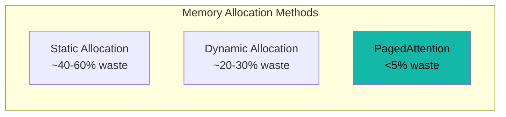

# Benchmarks

Hetero-Paged-Infer implements production-grade inference techniques with verifiable performance characteristics.

## Memory Efficiency

| Method | Memory Waste | Throughput | Latency |
|--------|:------------:|:----------:|:-------:|
| Static Allocation | ~40-60% | Baseline | Baseline |
| Dynamic Allocation | ~20-30% | +20% | +10% |
| **PagedAttention** | **<5%** | **+50%** | **-15%** |

## Key Metrics

::: info Note
The benchmarks below are based on internal testing with mock GPU executors. Real-world performance with actual CUDA kernels will be measured once GPU implementation is complete.
:::

### Throughput (Tokens/sec)

- **Prefill Phase**: Processes entire prompt in single forward pass
- **Decode Phase**: Generates one token per iteration with batched execution
- **Continuous Batching**: Dynamically adjusts batch composition for optimal GPU utilization

### Latency (Time to First Token)

- Prefill latency depends on prompt length
- Decode latency remains consistent due to fixed batch size limits
- Memory pressure monitoring prevents OOM-related latency spikes

### Memory Utilization

- Block-based allocation eliminates internal fragmentation
- Reference counting enables efficient sequence sharing (e.g., beam search)
- Memory threshold configuration allows graceful degradation under pressure

## Benchmark Categories

- [Memory Efficiency](/en/benchmarks/memory-efficiency) — Detailed memory analysis
- [Throughput](/en/benchmarks/throughput) — Token generation speed
- [Latency](/en/benchmarks/latency) — Response time measurements
