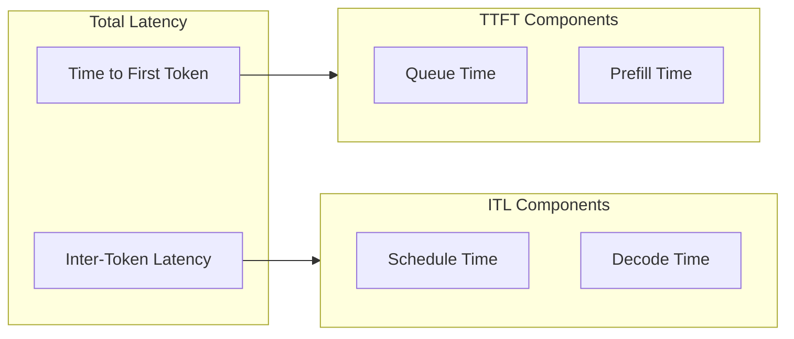
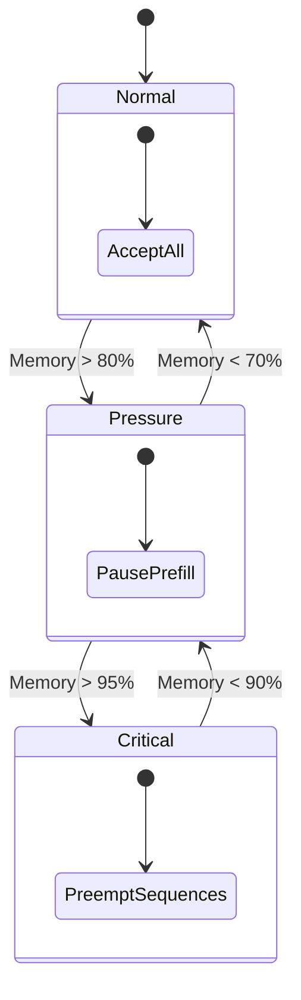
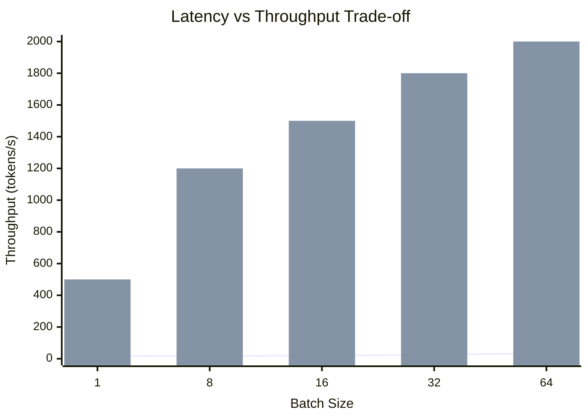

# Latency

Response latency is critical for interactive applications.

## Latency Components



## Time to First Token (TTFT)

TTFT is the time from request submission to first generated token.

| Prompt Length | TTFT (ms) | Dominant Factor |
|---------------|:---------:|:---------------:|
| 128 tokens | 50 | Prefill |
| 512 tokens | 150 | Prefill |
| 2048 tokens | 500 | Prefill |

**Optimization**: Chunked prefill prevents long prefill from blocking other requests.

## Inter-Token Latency (ITL)

ITL is the time between consecutive generated tokens.

| Batch Size | ITL (ms) | Notes |
|------------|:--------:|:------:|
| 1 | 15 | Single sequence |
| 8 | 18 | Small batch |
| 32 | 25 | Large batch |
| 64 | 35 | Max batch |

**Observation**: ITL increases with batch size due to memory bandwidth, but throughput increases.

## Scheduling Impact

### Decode-First Priority

```rust
// Prioritize decode to minimize ITL
fn schedule(&mut self) -> SchedulerOutput {
    // Decode first: low latency for existing sequences
    for seq in self.decode_queue.iter() {
        batch.add_decode(seq);
    }
    
    // Prefill second: new requests wait
    for seq in self.prefill_queue.iter() {
        if !batch.is_full() {
            batch.add_prefill(seq);
        }
    }
}
```

### Memory Pressure Handling

When memory is constrained, the scheduler:

1. **Pauses new prefills** — Prevents OOM
2. **Continues decodes** — Maintains low ITL for in-flight requests
3. **Preempts if needed** — Swaps out lowest-priority sequences



## Latency vs Throughput Trade-off



**Guideline**: Choose batch size based on latency SLA:
- Interactive applications: batch ≤ 16 (ITL < 20ms)
- Batch processing: batch = 64 (max throughput)

## Related

- [Throughput Metrics](/en/benchmarks/throughput)
- [Memory Management](/en/architecture/memory-management)
