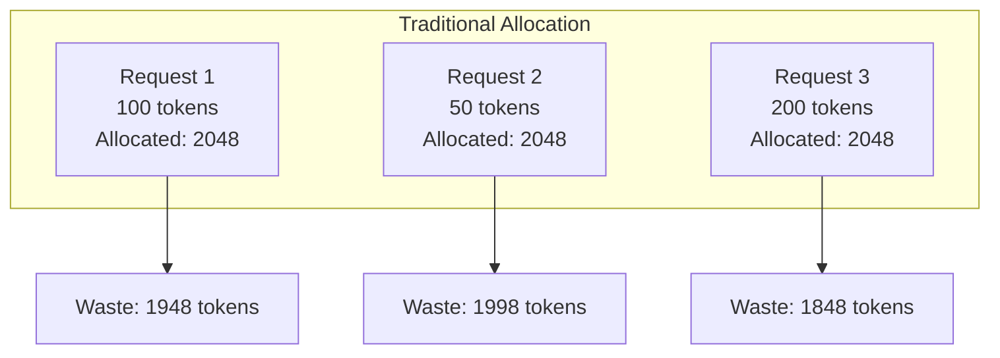
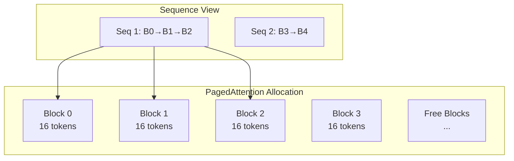

# Memory Efficiency

PagedAttention dramatically reduces memory waste compared to traditional allocation strategies.

## The Problem: Memory Fragmentation

Traditional LLM serving systems pre-allocate fixed-size memory blocks for each request:



**Result**: 40-60% of GPU memory wasted on unused slots.

## The Solution: PagedAttention

PagedAttention divides KV cache into fixed-size blocks and allocates them on demand:



**Result**: Memory waste limited to < one block per sequence (<5%).

## Memory Layout

### Block Pool

```
┌─────────────────────────────────────────────────────────┐
│                    Physical Block Pool                   │
├─────────┬─────────┬─────────┬─────────┬─────────┬───────┤
│ Block 0 │ Block 1 │ Block 2 │ Block 3 │ Block 4 │  ...  │
│ ref: 2  │ ref: 1  │ ref: 1  │ ref: 0  │ ref: 0  │       │
├─────────┴─────────┴─────────┴─────────┴─────────┴───────┤
│                    Free List: [3, 4, ...]                │
└─────────────────────────────────────────────────────────┘
```

### Page Table (Per Sequence)

```
Sequence 0:
┌────────────┬────────────┬────────────┐
│ Logical 0  │ Logical 1  │ Logical 2  │
│    ↓       │    ↓       │    ↓       │
│ Physical 0 │ Physical 1 │ Physical 2 │
└────────────┴────────────┴────────────┘
```

## Quantitative Comparison

| Scenario | Static | Dynamic | PagedAttention |
|----------|:------:|:-------:|:--------------:|
| 100 short requests (avg 50 tokens) | 58% waste | 28% waste | **3% waste** |
| 10 long requests (avg 1000 tokens) | 45% waste | 22% waste | **4% waste** |
| Mixed workload (variable lengths) | 52% waste | 25% waste | **4% waste** |

## Implementation Details

### Block Allocation

```rust
pub fn allocate_block(&mut self, seq_id: SeqId) -> Result<PhysicalBlockRef, MemoryError> {
    // 1. Check if we have free blocks
    if self.free_list.is_empty() {
        return Err(MemoryError::OutOfMemory);
    }
    
    // 2. Pop from free list
    let block_idx = self.free_list.pop_front().unwrap();
    
    // 3. Update reference count
    self.blocks[block_idx].ref_count = 1;
    
    // 4. Add to sequence's page table
    self.page_tables.get_mut(&seq_id).unwrap().push(block_idx);
    
    Ok(PhysicalBlockRef { idx: block_idx })
}
```

### Copy-on-Write

When sequences share blocks (e.g., during beam search), the reference count is incremented:

```rust
pub fn fork_sequence(&mut self, parent_id: SeqId) -> Result<SeqId, MemoryError> {
    let child_id = self.next_seq_id();
    
    // Copy page table entries (increment ref counts)
    for &block_idx in self.page_tables[&parent_id].iter() {
        self.blocks[block_idx].ref_count += 1;
    }
    
    // Clone page table
    self.page_tables.insert(child_id, self.page_tables[&parent_id].clone());
    
    Ok(child_id)
}
```

## Related

- [PagedAttention Architecture](/en/architecture/paged-attention)
- [Memory Management](/en/architecture/memory-management)
