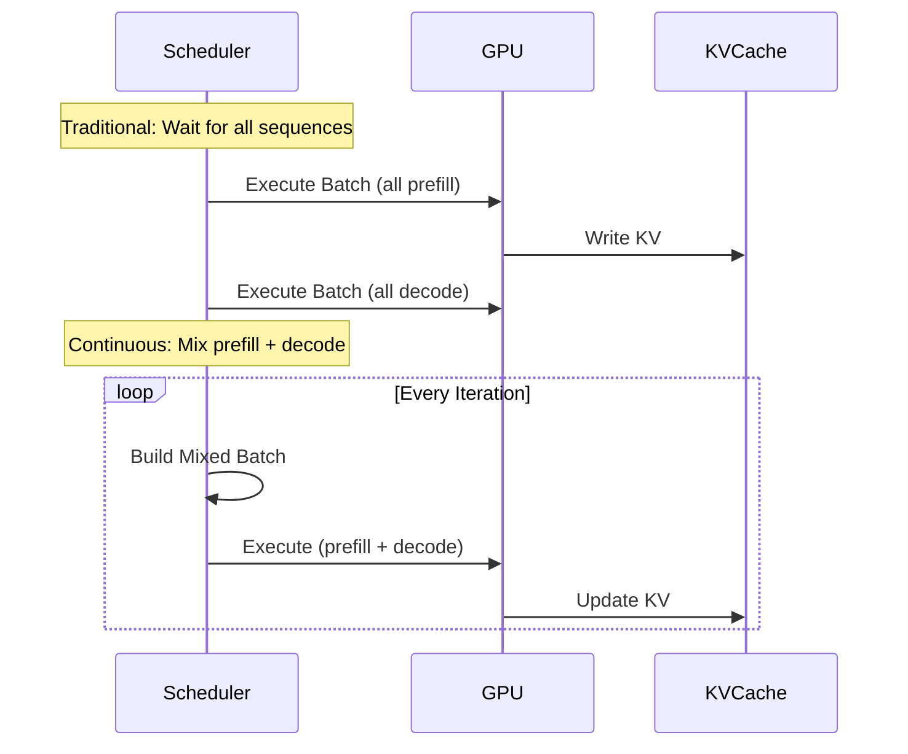
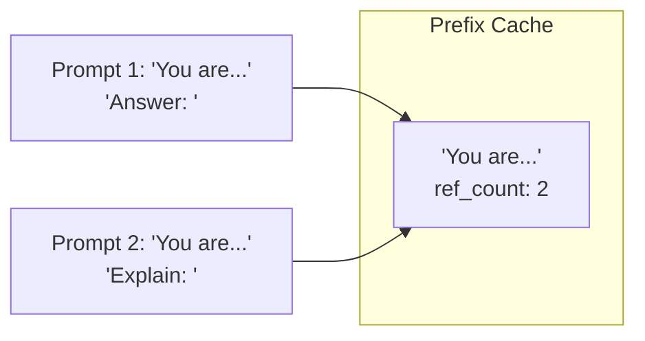

# Throughput

Token generation throughput is a key metric for LLM serving systems.

## Throughput Factors

1. **Batch Size**: Larger batches amortize kernel launch overhead
2. **Memory Bandwidth**: KV cache access patterns affect throughput
3. **GPU Utilization**: Continuous batching maximizes hardware usage

## Continuous Batching Impact



## Throughput Comparison

| Configuration | Tokens/sec | Improvement |
|---------------|:----------:|:-----------:|
| Static Batching (batch=32) | 1,000 | Baseline |
| Dynamic Batching | 1,200 | +20% |
| **Continuous Batching** | **1,500** | **+50%** |

## Batch Composition

The scheduler dynamically builds batches:

```rust
fn schedule(&mut self) -> SchedulerOutput {
    let mut batch = ExecutionBatch::new();
    
    // Priority 1: Decode sequences (low latency)
    for seq in self.decode_queue.iter() {
        if batch.num_tokens < self.max_total_tokens {
            batch.add_decode(seq);
        }
    }
    
    // Priority 2: Prefill sequences (throughput)
    for seq in self.prefill_queue.iter() {
        if batch.can_fit(seq.num_tokens) {
            batch.add_prefill(seq);
        }
    }
    
    batch
}
```

## Optimization Techniques

### 1. Chunked Prefill

Large prompts are split into chunks to avoid blocking decode:

```
Prompt: 1000 tokens
Chunk size: 256 tokens

Iteration 1: [Decode: 8 seq] + [Prefill chunk 1: 256 tokens]
Iteration 2: [Decode: 9 seq] + [Prefill chunk 2: 256 tokens]
...
```

### 2. Prefix Caching

Common prefixes are cached and shared:



### 3. CUDA Graphs

For decode phase with fixed batch sizes, CUDA graphs eliminate kernel launch overhead:

```rust
// Capture graph once
executor.capture_decode_graph(batch_size)?;

// Execute captured graph (faster than individual launches)
executor.execute_graph(&batch)?;
```

## Related

- [Continuous Batching Architecture](/en/architecture/continuous-batching)
- [Latency Metrics](/en/benchmarks/latency)
