# 连续批处理

Continuous Batching（连续批处理）是一种动态调度技术，可在推理迭代之间添加/移除序列，显著提升 GPU 利用率和吞吐量。

## 问题：静态批处理

传统静态批处理需要等待所有序列完成才能开始新批次：

```mermaid
gantt
    title 静态批处理时间线
    dateFormat X
    section Batch 1
    Seq 1 Prefill   :0, 2
    Seq 1 Decode    :2, 8
    Seq 2 Prefill   :0, 2
    Seq 2 Decode    :2, 6
    section 空闲
    GPU 空闲等待    :crit, 6, 8
```



**问题**：
- GPU 空闲等待最短序列完成
- 新请求必须等待整个批次完成
- 吞吐量受限

## 解决方案：连续批处理

Continuous Batching 在每个迭代后动态调整批次：

```mermaid
gantt
    title 连续批处理时间线
    dateFormat X
    section Iteration 1-2
    Seq 1 Prefill   :0, 2
    Seq 2 Prefill   :0, 2
    section Iteration 3-8
    Seq 1 Decode    :2, 8
    Seq 2 Decode    :2, 6
    Seq 3 Prefill   :6, 8
```



**优势**：
- 新请求立即加入批次
- 完成的序列立即释放资源
- GPU 利用率最大化

## 调度策略

### 优先级顺序

1. **Decode 优先**：优先调度 decode 序列，保持低延迟
2. **Prefill 次之**：填充剩余批次槽位
3. **新请求**：在内存允许时开始新的 prefill

```rust
impl Scheduler {
    pub fn schedule(&mut self) -> SchedulerOutput {
        let mut output = SchedulerOutput::new();
        
        // 优先级 1: Decode 序列
        for seq_id in self.decode_queue.iter() {
            output.add_decode(*seq_id);
        }
        
        // 优先级 2: Prefill 序列
        for seq_id in self.prefill_queue.iter() {
            output.add_prefill(*seq_id);
        }
        
        // 优先级 3: 新请求
        if !self.under_memory_pressure() {
            // ...
        }
        
        output
    }
}
```

## 内存压力感知

当内存接近耗尽时，调度器采取防御措施：

```mermaid
stateDiagram-v2
    [*] --> Normal
    
    Normal --> Pressure: 使用 > 80%
    Normal --> Critical: 使用 > 95%
    
    state Normal {
        note right of Normal: 接受所有新请求
    }
    
    state Pressure {
        note right of Pressure: 暂停新 prefill，继续 decode
    }
    
    state Critical {
        note right of Critical: 抢占低优先级序列
    }
```

## 性能影响

| 指标 | 静态批处理 | 连续批处理 | 提升 |
|------|:----------:|:----------:|:----:|
| GPU 利用率 | ~60% | ~90% | +50% |
| 吞吐量 | 1000 tok/s | 1500 tok/s | +50% |

## 相关

- [PagedAttention](/zh/architecture/paged-attention)
- [内存管理](/zh/architecture/memory-management)
- [吞吐量基准](/zh/benchmarks/throughput)