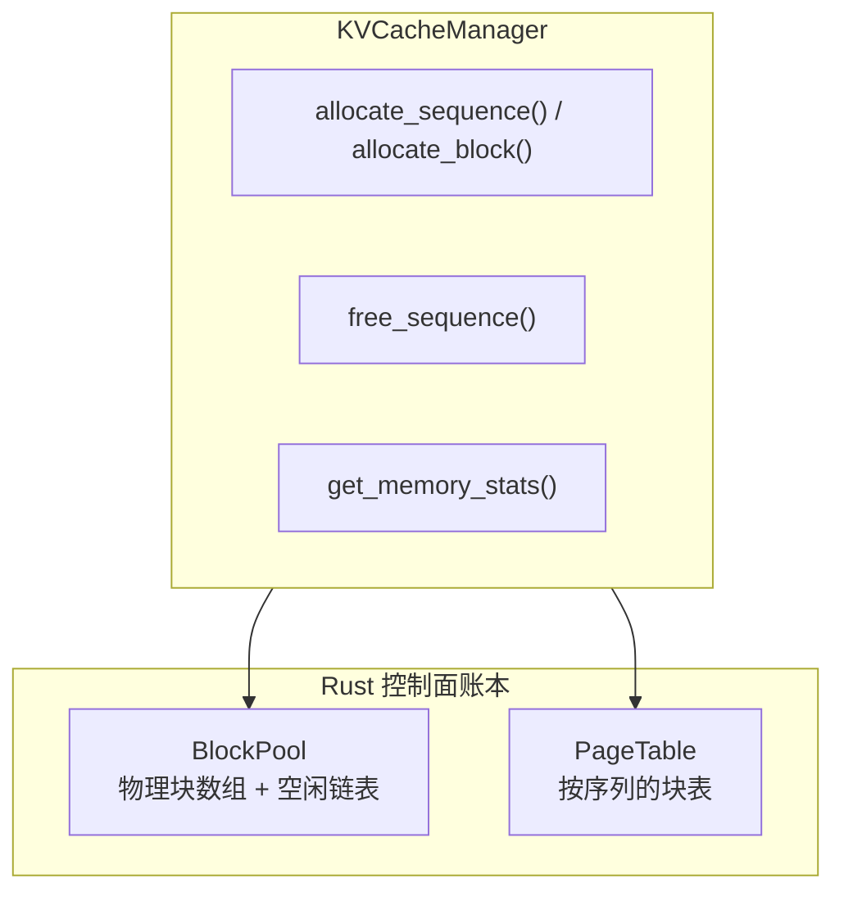

# 内存管理

Hetero-Paged-Infer 的内存管理由固定大小的块池、按序列的页表和单一阈值的准入策略组成。块的分配与回收全部是 Rust 侧账本，当前尚未由真实 GPU 内存承载——这套账本为调度器提供了真实、可查询的资源依据。

## 内存架构



物理块（`PhysicalBlock`）只承载 `block_idx` 与 `ref_count`，不持有 KV 张量或 GPU 指针。项目不加载模型权重，因此也没有权重 / 激活值内存区域。

## 内存配置

内存相关参数位于 `EngineConfig`（没有单独的 KV cache 配置结构）：

```rust
pub struct EngineConfig {
    /// 每个物理块容纳的 token 数 (默认: 16)
    pub block_size: u32,

    /// 物理块最大数量；总容量 = max_num_blocks * block_size tokens (默认: 1024)
    pub max_num_blocks: u32,

    /// 内存压力阈值，有效范围 (0.0, 1.0] (默认: 0.9)
    pub memory_threshold: f32,
    // ... 其余字段与内存管理无直接关系
}
```

### 块大小选择

| 块大小 | 优点 | 缺点 |
|--------|------|------|
| 小 (8) | 更细粒度分配 | 更多页表开销 |
| 中 (16) | 平衡 | 平衡 |
| 大 (32) | 更少页表开销 | 更多末块尾部浪费 |

默认为 16 tokens/块，也是 vLLM 的常见取值。

## 内存压力处理

系统只有单一阈值，**没有分级压力、没有抢占（preemption）、没有 swap、没有驱逐**：

- 调度器在准入与调度时计算 `utilization = used_blocks / total_blocks`
- 当 `utilization >= memory_threshold` 时，`Scheduler::add_request` 返回 `SchedulerError::MemoryPressure`，拒绝接收新请求
- HTTP 层把该错误映射为 **429 Too Many Requests**，并附带 `Retry-After`
- 在途 decode 序列不受影响；它们完成或失败后块被回收，利用率下降，准入自动恢复

```rust
pub fn add_request(&mut self, request: Request) -> Result<SeqId, SchedulerError> {
    self.update_memory_pressure();

    if self.under_memory_pressure {
        return Err(SchedulerError::MemoryPressure);
    }
    // ... 并发上限检查后入队
}
```

引用计数仅用于块的分配与回收：分配时 `ref_count` 置 1，`free_sequence` 使其归零后块回到空闲链表。当前没有序列间的块共享；Copy-on-Write 属于未来方向，引用计数是其脚手架（另见 [PagedAttention](/zh/architecture/paged-attention) 的"当前实现状态"）。

## 内存统计

```rust
pub struct MemoryStats {
    /// 物理块总数
    pub total_blocks: u32,
    /// 已使用的物理块数
    pub used_blocks: u32,
    /// 空闲物理块数
    pub free_blocks: u32,
    /// 活跃序列数
    pub num_sequences: u32,
}

impl MemoryStats {
    /// 内存利用率 = used_blocks / total_blocks
    pub fn utilization(&self) -> f32;
}
```

`KVCacheManager::get_memory_stats()` 返回该结构；调度器的准入判断与服务层 `/metrics` 暴露的内存指标都建立在它之上。

## 内存效率验证

通过属性测试（proptest，位于 `src/kv_cache.rs`）验证内存不变量：

```rust
proptest! {
    /// 验证：used + free == total
    #[test]
    fn prop_block_count_invariant(
        ops in prop::collection::vec(arb_cache_op(), 0..50),
        num_blocks in 10u32..200,
        block_size in 1u32..32,
    ) {
        let mut manager = KVCacheManager::new(num_blocks, block_size);

        for op in ops {
            apply_operation(&mut manager, op);  // allocate / free / grow

            let stats = manager.get_memory_stats();
            prop_assert_eq!(
                stats.used_blocks + stats.free_blocks,
                stats.total_blocks
            );
        }
    }
}
```

同一文件还覆盖初次分配、增长分配与统计一致性等属性（`prop_block_allocation_on_sequence_start`、`prop_block_allocation_on_growth`、`prop_memory_statistics_invariant`）。

## 相关

- [PagedAttention](/zh/architecture/paged-attention)
- [连续批处理](/zh/architecture/continuous-batching)
