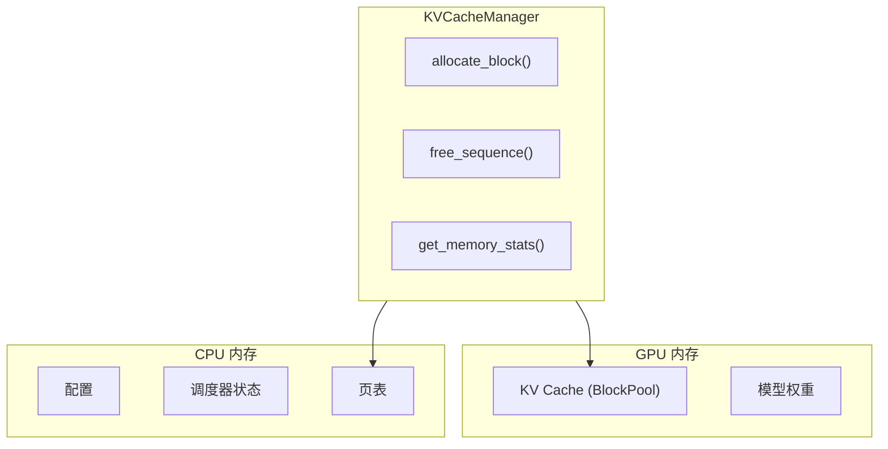

# 内存管理

Hetero-Paged-Infer 的内存管理策略结合了 PagedAttention 和内存压力感知，确保高效且安全的内存使用。

## 内存架构



## 内存配置

```rust
pub struct KVCacheConfig {
    /// 每个块的 token 数量 (默认: 16)
    pub block_size: u32,
    
    /// 物理块总数 (根据 GPU 内存计算)
    pub num_blocks: u32,
    
    /// 内存压力阈值 (默认: 0.85)
    pub memory_threshold: f32,
    
    /// 是否启用抢占 (默认: true)
    pub enable_preemption: bool,
}
```

### 块大小选择

| 块大小 | 优点 | 缺点 |
|--------|------|------|
| 小 (8) | 更细粒度分配 | 更多页表开销 |
| 中 (16) | 平衡 | 平衡 |
| 大 (32) | 更少页表开销 | 更多内部碎片 |

**推荐**: 16 tokens/块，与 vLLM 一致。

## 内存压力处理

### 分级响应

- **Normal (<80%)**: 接受所有请求
- **Pressure (80-95%)**: 暂停新 prefill，继续 decode
- **Critical (>95%)**: 抢占低优先级序列

### 抢占策略

```rust
pub enum PreemptionPolicy {
    /// 抢占最晚到达的序列 (默认)
    FIFO,
    /// 抢占剩余 token 最多的序列
    LongestRemaining,
    /// 抢占优先级最低的序列
    LowestPriority,
}
```

## 内存效率验证

通过属性测试验证内存不变量：

```rust
proptest! {
    /// 验证：used + free == total
    #[test]
    fn prop_block_count_invariant(ops: Vec<KVOperation>) {
        let mut manager = KVCacheManager::new(100, 16);
        
        for op in ops {
            execute_operation(&mut manager, op);
            
            let stats = manager.get_memory_stats();
            prop_assert_eq!(
                stats.used_blocks + stats.free_blocks,
                stats.total_blocks
            );
        }
    }
}
```

## 相关

- [PagedAttention](/zh/architecture/paged-attention)
- [连续批处理](/zh/architecture/continuous-batching)
- [内存效率基准](/zh/benchmarks/memory-efficiency)