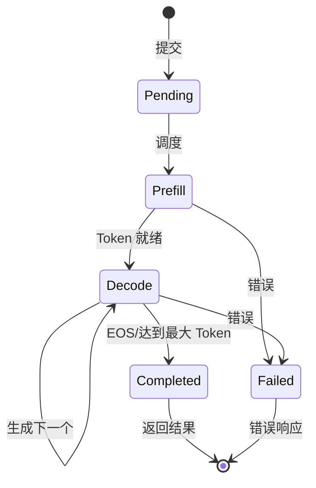
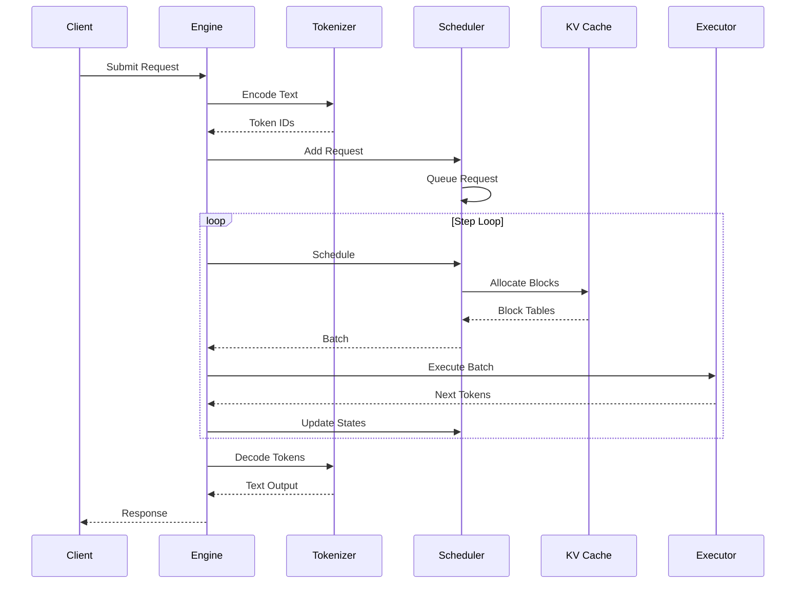

# 架构概览

## 设计理念

Hetero-Paged-Infer 是一个 LLM 推理引擎脚手架：实现 PagedAttention 风格的分页内存、Continuous Batching 调度器，以及 OpenAI 兼容的 HTTP 服务层。计算后端当前为 mock / 占位实现——调度、内存账本与服务链路是真实、可运行、有测试的代码；真实模型计算（权重加载、attention kernel）属于未来工作，另见首页的"当前边界"一节。

### 核心原则

1. **Rust 控制面** — 调度、块账本、页表与批次构建都在 Rust 侧，可推理、可测试
2. **可插拔计算后端** — `GPUExecutorTrait` 抽象批次执行，默认 mock 执行器生成确定性占位 token
3. **内存效率** — 块池 + 页表的分页分配，避免按请求预留连续内存的浪费
4. **连续批处理** — Decode 优先的批次构建，优先推进在途请求

## 高层架构

<ThemeAwareFigure
  light="/images/figures/architecture-light.svg"
  dark="/images/figures/architecture-dark.svg"
  alt="Hetero-Paged-Infer 控制面与计算面架构图"
  caption="这里强调的是控制面 / 计算面的边界，而不是简单列出功能点。"
/>

## 组件详解

### 1. 推理引擎

协调所有组件的主编排器：

```rust
pub struct InferenceEngine {
    config: EngineConfig,
    tokenizer: Box<dyn TokenizerTrait>,
    scheduler: Scheduler,
    execution_pipeline: BatchExecutionPipeline,
    eos_token_id: u32,
    // 内部计数器：请求总数、完成/失败数、已生成 token 数等
}
```

**职责：**
- 请求生命周期管理（提交、步进、完成/失败）
- 逐步执行循环（调度 → 执行 → 回收结果）
- 执行失败重试（`max_retry_attempts`，针对 GpuTimeout）
- 指标数据收集（经服务层 `/metrics` 暴露）

### 2. 调度器

实现带有 Decode 优先的**连续批处理**：



**调度算法：**

```
1. 收集 Decode 请求（最高优先级，降低在途请求延迟）
2. 用 Prefill 请求填充剩余批处理槽位（按 seq_id 序，FCFS）
3. 遵守批大小、token 总数、并发序列数与内存约束
4. 更新请求状态；利用率 ≥ memory_threshold 时拒绝接收新请求
```

### 3. KV Cache 管理器

实现 **PagedAttention** 风格的分页内存账本。块池是固定大小的物理块数组加空闲链表，每个序列维护一张页表：

```
┌─────────────────────────────────────────────────────────────┐
│               KV Cache 块池（Rust 控制面账本）                │
├─────────────────────────────────────────────────────────────┤
│ Block 0 │ Block 1 │ Block 2 │ ... │ Block N                  │
└─────────────────────────────────────────────────────────────┘
      ↑
页表映射：
  Sequence 0: [Block 3] → [Block 7] → [Block 12]
  Sequence 1: [Block 1] → [Block 5] → [Block 9]
```

注意：物理块当前只承载账本元数据（`block_idx` + `ref_count`），尚不持有真实 KV 张量；由真实后端消费这套块表结构属于未来工作。

### 4. GPU 执行器

抽象批次执行：

```rust
pub trait GPUExecutorTrait: Send {
    fn execute(&mut self, batch: &ExecutionBatch)
        -> Result<ExecutionOutput, ExecutionError>;
}
```

默认 `MockGPUExecutor` 生成确定性占位 token（与输入内容无关）；`cuda` feature 提供的最小 kernel 路径同样只做 `(seed + index) % vocab_size` 的占位生成。两者都不加载权重、不消费 KV cache、不做 attention 计算。

## 数据流

### 请求处理流水线



## 内存模型

### 块结构

```rust
pub struct PhysicalBlock {
    pub block_idx: BlockIdx,  // 物理块索引
    pub ref_count: u32,       // 引用计数，归零即空闲
}
```

物理块当前不持有 GPU 内存指针；`ref_count` 仅用于分配与回收。Copy-on-Write 风格的块复用是未来方向，引用计数为此留出了脚手架。

### 内存布局

默认 `block_size = 16` 时，序列的 token 按块组织：

```
Token Positions:
┌─────────────────────────────────────────────────────┐
│ Block 0 │ Block 1 │ Block 2 │ Block 3 │ Block 4     │
│ 0-15    │ 16-31   │ 32-47   │ 48-63   │ 64-79       │
└─────────────────────────────────────────────────────┘
```

序列的最后一个块通常不满——这是块模型内部唯一的浪费边界。

## 性能特征

### 基准测试

当前基准测试（`benches/`，基于 Criterion）只测量引擎级开销：引擎创建、请求提交、单步调度、KV cache 分配与增长。它们**不测量 token 吞吐量**，也不提供 tokens/s 数字。

### 内存效率（文献引用）

下表数字来自 PagedAttention 论文（Kwon et al., 2023）及相关先行工作的观察值，**不是本项目的测量结果**，仅用于说明分页分配的动机：

| 方法 | 内部浪费 | 外部碎片 | 总计 |
|------|---------|---------|------|
| 静态分配 | ~45% | ~10% | ~55% |
| 动态分配 | ~20% | ~8% | ~28% |
| **Paged** | **<5%** | **<2%** | **<7%** |

## 可扩展性

当前引擎是单进程实现：一个调度器、一个块池、一个服务实例。多实例 + 负载均衡的水平扩展不是当前能力，属于未来方向。

单进程内的容量调优通过 `EngineConfig`：

- `max_num_blocks × block_size` 决定 KV cache 总 token 容量
- `max_batch_size` / `max_num_seqs` 限制单批大小与并发序列上限
- `memory_threshold` 决定内存利用率的准入门槛

## 安全考量

1. **准入控制** — 内存利用率 ≥ 阈值或并发序列数达上限时拒绝新请求（HTTP 429 + `Retry-After`）
2. **输入验证** — `max_model_len` 等 token 数量限制，非法参数返回 400
3. **执行重试** — GpuTimeout 按 `max_retry_attempts` 重试，超限后失败该批请求
4. **错误隔离** — 失败请求释放其占用的块，不影响其他在途序列

---

下一步：[设计原则](design)
