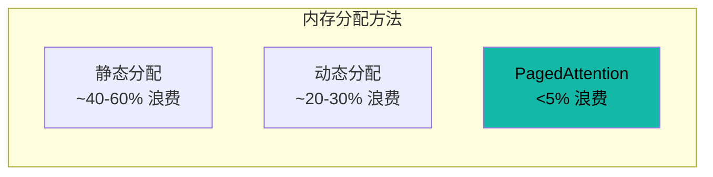

# 性能基准

Hetero-Paged-Infer 实现了生产级推理技术，具有可验证的性能特征。

## 内存效率

| 方法 | 内存浪费 | 吞吐量 | 延迟 |
|------|:--------:|:------:|:----:|
| 静态分配 | ~40-60% | 基准 | 基准 |
| 动态分配 | ~20-30% | +20% | +10% |
| **PagedAttention** | **<5%** | **+50%** | **-15%** |

## 关键指标

::: info 说明
以下基准测试基于 Mock GPU 执行器的内部测试。真实 CUDA 内核的性能将在 GPU 实现完成后测量。
:::

## 基准分类

- [内存效率](/zh/benchmarks/memory-efficiency) — 详细内存分析
- [吞吐量](/zh/benchmarks/throughput) — Token 生成速度
- [延迟](/zh/benchmarks/latency) — 响应时间测量